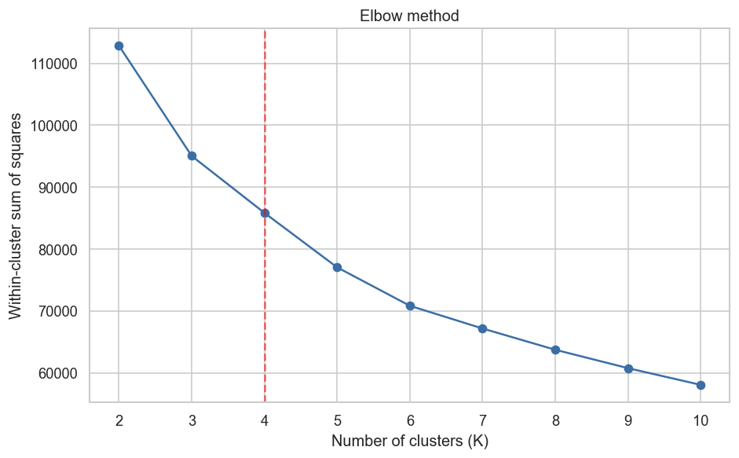
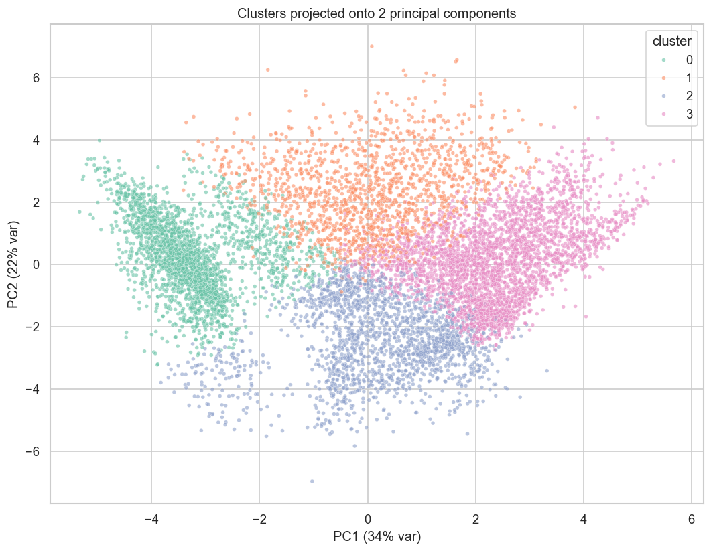
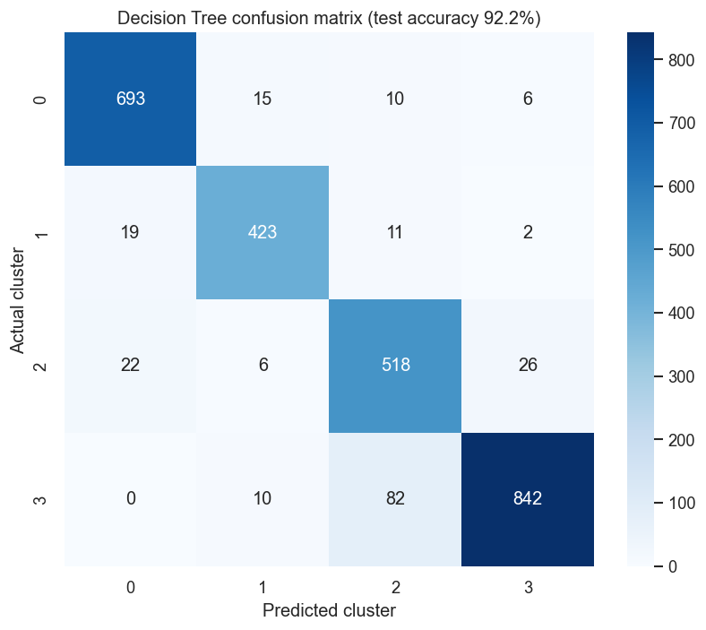
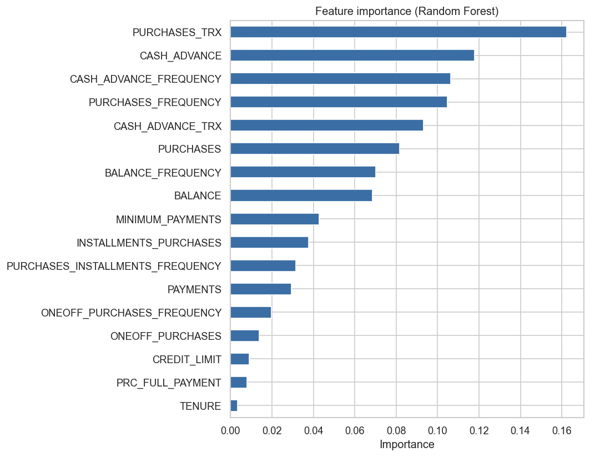

# Credit Card Customer Segmentation

Finding the natural groups of customers in a credit card dataset, and then
building a model that can place a new customer into the right group.

This is a small end-to-end analytics project: data cleaning, exploration,
unsupervised clustering, and a supervised model on top. I did it in Python
(pandas, scikit-learn) with a bit of SQL for the profiling side.

## The data

A public dataset from Kaggle, *Credit Card Dataset for Clustering*. It has about
**8,950 cardholders** and **17 behaviour features** describing 6 to 12 months of
activity - balance, purchases, cash advance, payment habits, credit limit,
tenure, and so on. There is no target column (no default, no revenue), so this
is a behavioural / descriptive problem, not a direct prediction of money.

Source: https://www.kaggle.com/datasets/arjunbhasin2013/ccdata

---

## What I did

1. **Clean** - drop the id column, fill the two columns that have missing values
   with the median (they are skewed, so median is safer than mean).
2. **Explore** - look at the distributions and the correlation between features.
3. **Transform + scale** - log-transform the skewed money columns, then z-score
   everything so K-Means treats all features fairly.
4. **Cluster** - K-Means, with the Elbow and Silhouette methods to choose the
   number of groups. I land on **K = 4**.
5. **Cross-check** - run a second clustering method (hierarchical) and measure
   how much it agrees, to make sure the groups are real and not just an artefact
   of K-Means.
6. **Profile** - describe each group in plain business language.
7. **Predict** - train a Decision Tree and a Random Forest to classify a
   customer into one of the 4 groups.

## Key results

**Choosing K** - the elbow bends and the silhouette is reasonable around K = 4:



**The 4 groups in 2D** (using PCA only for the plot). You can see the groups are
separated but a couple of them overlap a bit, so the borders are soft:



**Predicting the group** - the Decision Tree already gets about 92% on unseen
data and is fully readable, the Random Forest is higher but a black box:

| Model | Test accuracy | Kappa |
|---|---|---|
| Decision Tree (`max_depth=5`) | **92.2 %** | 0.89 |
| Random Forest (200 trees) | **96.4 %** | 0.95 |



The features that matter most for telling the groups apart are purchase activity
and cash-advance behaviour:



---

## The four customer segments

(the cluster numbers come out random each run, so I describe them by behaviour.)

| Segment | Share | What they do | Business angle |
|---|---|---|---|
| **Cash-advance users** | ~27% | High balance, almost no purchases, high cash advance, never pay in full | Expensive borrowing - watch for credit risk |
| **High-balance heavy users** | ~17% | Highest balance & credit limit, buy a lot *and* take a lot of cash | The most credit exposure sits here |
| **Low-activity / light users** | ~21% | Very low balance and purchases, card barely used | Big group to try to activate |
| **Active responsible spenders** | ~35% | Buy a lot and often, almost no cash advance, highest full-payment rate | The healthy base - loyalty / upsell |

**So what could a business do with this?**
- The cash-advance and high-balance groups are where the credit risk is. Simple
  thresholds on cash advance and balance could flag them early.
- The active responsible spenders are the best base for loyalty and upsell.
- The low-activity group is large and basically dormant - an activation campaign
  could move some of them up.
---

## How to run it

```bash
# 1. install the libraries
pip install -r requirements.txt

# 2. run the full analysis (this regenerates every figure)
python src/analysis.py

# 3. or open the notebook to read it step by step
jupyter notebook notebooks/customer_segmentation.ipynb

# 4. (optional) run the SQL profiling queries
python sql/run_sql.py
```

---

## Notes and limitations

- There is no outcome column in the data, so everything here is **descriptive**.
  I am grouping behaviour, not predicting default or revenue directly.
- The border between a couple of the segments is soft (visible in the PCA plot),
  so the segments are a useful guide, not hard lines.
- The supervised model is trained on the K-Means labels, so it is really
  learning "what makes a customer look like cluster X" - it is a fast way to
  classify new customers without re-running the clustering each time.

---

## Tools

Python (pandas, scikit-learn, matplotlib, seaborn), SQL (SQLite), Jupyter.
Original concept first explored in R.

---

**Ebrahim Sharifi, Ph.D., P.Eng.** — Toronto, ON

Looking for business analytics / data analytics / supply chain analytics roles.

- GitHub: https://github.com/ebiisharifi
- Website: https://ebiisharifi.github.io/
- LinkedIn: https://www.linkedin.com/in/ebrahim-sharifi-ph-d-p-eng-2147b781/
- Email: esharifi1372@gmail.com
